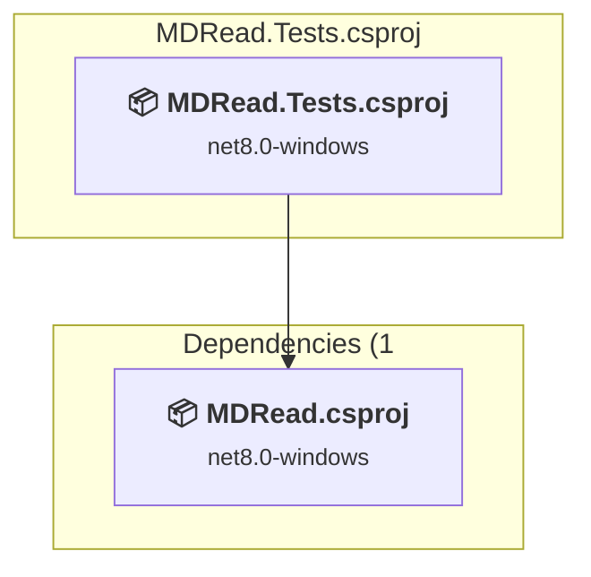
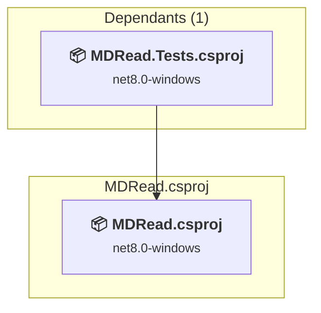

# Projects and dependencies analysis

This document provides a comprehensive overview of the projects and their dependencies in the context of upgrading to .NETCoreApp,Version=v10.0.

## Table of Contents

- [Executive Summary](#executive-Summary)
  - [Highlevel Metrics](#highlevel-metrics)
  - [Projects Compatibility](#projects-compatibility)
  - [Package Compatibility](#package-compatibility)
  - [API Compatibility](#api-compatibility)
  - [Binding Redirect Configuration](#binding-redirect-configuration)
- [Aggregate NuGet packages details](#aggregate-nuget-packages-details)
- [Top API Migration Challenges](#top-api-migration-challenges)
  - [Technologies and Features](#technologies-and-features)
  - [Most Frequent API Issues](#most-frequent-api-issues)
- [Projects Relationship Graph](#projects-relationship-graph)
- [Project Details](#project-details)

  - [MDRead.Tests\MDRead.Tests.csproj](#mdreadtestsmdreadtestscsproj)
  - [MDRead\MDRead.csproj](#mdreadmdreadcsproj)

## Executive Summary

### Highlevel Metrics

| Metric | Count | Status |
| :--- | :---: | :--- |
| Total Projects | 2 | All require upgrade |
| Total NuGet Packages | 7 | 1 need upgrade |
| Total Code Files | 33 |  |
| Total Code Files with Incidents | 16 |  |
| Total Lines of Code | 4163 |  |
| Total Number of Issues | 432 |  |
| Estimated LOC to modify | 429+ | at least 10,3% of codebase |

### Projects Compatibility

| Project | Target Framework | Difficulty | Package Issues | API Issues | Binding Issues | Est. LOC Impact | Description |
| :--- | :---: | :---: | :---: | :---: | :---: | :---: | :--- |
| [MDRead.Tests\MDRead.Tests.csproj](#mdreadtestsmdreadtestscsproj) | net8.0-windows | 🟢 Low | 1 | 22 | 0 | 22+ | DotNetCoreApp, Sdk Style = True |
| [MDRead\MDRead.csproj](#mdreadmdreadcsproj) | net8.0-windows | 🟡 Medium | 0 | 407 | 0 | 407+ | Wpf, Sdk Style = True |

### Package Compatibility

| Status | Count | Percentage |
| :--- | :---: | :---: |
| ✅ Compatible | 6 | 85,7% |
| ⚠️ Incompatible | 1 | 14,3% |
| 🔄 Upgrade Recommended | 0 | 0,0% |
| ***Total NuGet Packages*** | ***7*** | ***100%*** |

### API Compatibility

| Category | Count | Impact |
| :--- | :---: | :--- |
| 🔴 Binary Incompatible | 396 | High - Require code changes |
| 🟡 Source Incompatible | 1 | Medium - Needs re-compilation and potential conflicting API error fixing |
| 🔵 Behavioral change | 32 | Low - Behavioral changes that may require testing at runtime |
| ✅ Compatible | 3643 |  |
| ***Total APIs Analyzed*** | ***4072*** |  |

## Aggregate NuGet packages details

| Package | Current Version | Suggested Version | Projects | Description |
| :--- | :---: | :---: | :--- | :--- |
| CommunityToolkit.Mvvm | 8.4.2 |  | [MDRead.csproj](#mdreadmdreadcsproj) | ✅Compatible |
| coverlet.collector | 6.0.4 |  | [MDRead.Tests.csproj](#mdreadtestsmdreadtestscsproj) | ✅Compatible |
| Markdig | 1.3.2 |  | [MDRead.csproj](#mdreadmdreadcsproj) | ✅Compatible |
| Microsoft.NET.Test.Sdk | 17.12.0 |  | [MDRead.Tests.csproj](#mdreadtestsmdreadtestscsproj) | ✅Compatible |
| Microsoft.Web.WebView2 | 1.0.4078.44 |  | [MDRead.csproj](#mdreadmdreadcsproj) | ✅Compatible |
| xunit | 2.9.2 |  | [MDRead.Tests.csproj](#mdreadtestsmdreadtestscsproj) | ⚠️Le package NuGet est déconseillé |
| xunit.runner.visualstudio | 2.8.2 |  | [MDRead.Tests.csproj](#mdreadtestsmdreadtestscsproj) | ✅Compatible |

## Top API Migration Challenges

### Technologies and Features

| Technology | Issues | Percentage | Migration Path |
| :--- | :---: | :---: | :--- |
| WPF (Windows Presentation Foundation) | 143 | 33,3% | WPF APIs for building Windows desktop applications with XAML-based UI that are available in .NET on Windows. WPF provides rich desktop UI capabilities with data binding and styling. Enable Windows Desktop support: Option 1 (Recommended): Target net9.0-windows; Option 2: Add <UseWindowsDesktop>true</UseWindowsDesktop>. |

### Most Frequent API Issues

| API | Count | Percentage | Category |
| :--- | :---: | :---: | :--- |
| T:System.Windows.MessageBoxResult | 27 | 6,3% | Binary Incompatible |
| T:System.Windows.Thickness | 26 | 6,1% | Binary Incompatible |
| T:System.Windows.Window | 18 | 4,2% | Binary Incompatible |
| T:System.Windows.Controls.TextBox | 16 | 3,7% | Binary Incompatible |
| T:System.Uri | 15 | 3,5% | Behavioral Change |
| T:System.Windows.GridLength | 11 | 2,6% | Binary Incompatible |
| T:System.Windows.Visibility | 10 | 2,3% | Binary Incompatible |
| T:System.Windows.Media.SolidColorBrush | 9 | 2,1% | Binary Incompatible |
| P:System.Uri.AbsoluteUri | 6 | 1,4% | Behavioral Change |
| T:System.Windows.MessageBoxImage | 6 | 1,4% | Binary Incompatible |
| T:System.Windows.MessageBoxButton | 6 | 1,4% | Binary Incompatible |
| T:System.Windows.Controls.RowDefinition | 6 | 1,4% | Binary Incompatible |
| T:System.Windows.Media.Brush | 5 | 1,2% | Binary Incompatible |
| T:System.Windows.DragDropEffects | 5 | 1,2% | Binary Incompatible |
| T:System.Windows.Controls.DockPanel | 4 | 0,9% | Binary Incompatible |
| F:System.Windows.MessageBoxResult.Yes | 4 | 0,9% | Binary Incompatible |
| M:System.Uri.#ctor(System.String) | 4 | 0,9% | Behavioral Change |
| T:System.Windows.Controls.GridSplitter | 4 | 0,9% | Binary Incompatible |
| T:System.Windows.Controls.Border | 4 | 0,9% | Binary Incompatible |
| T:System.Windows.DragEventHandler | 4 | 0,9% | Binary Incompatible |
| M:System.Windows.UIElement.Focus | 4 | 0,9% | Binary Incompatible |
| M:System.Windows.GridLength.#ctor(System.Double) | 4 | 0,9% | Binary Incompatible |
| T:System.Windows.Controls.Button | 3 | 0,7% | Binary Incompatible |
| P:System.Windows.FrameworkElement.Margin | 3 | 0,7% | Binary Incompatible |
| P:System.Windows.FrameworkElement.MinWidth | 3 | 0,7% | Binary Incompatible |
| T:System.Windows.Controls.TextBlock | 3 | 0,7% | Binary Incompatible |
| T:System.Windows.TextWrapping | 3 | 0,7% | Binary Incompatible |
| T:System.Windows.Controls.StackPanel | 3 | 0,7% | Binary Incompatible |
| T:System.Windows.HorizontalAlignment | 3 | 0,7% | Binary Incompatible |
| T:System.Windows.Controls.Orientation | 3 | 0,7% | Binary Incompatible |
| T:System.Windows.ResizeMode | 3 | 0,7% | Binary Incompatible |
| T:System.Windows.SizeToContent | 3 | 0,7% | Binary Incompatible |
| T:System.Windows.WindowStartupLocation | 3 | 0,7% | Binary Incompatible |
| M:System.Windows.Window.#ctor | 3 | 0,7% | Binary Incompatible |
| T:System.Windows.Controls.UIElementCollection | 3 | 0,7% | Binary Incompatible |
| P:System.Windows.Controls.Panel.Children | 3 | 0,7% | Binary Incompatible |
| M:System.Windows.Controls.UIElementCollection.Add(System.Windows.UIElement) | 3 | 0,7% | Binary Incompatible |
| P:Microsoft.Win32.FileDialog.FileName | 3 | 0,7% | Binary Incompatible |
| M:System.Uri.TryCreate(System.String,System.UriKind,System.Uri@) | 3 | 0,7% | Behavioral Change |
| T:System.Windows.Application | 3 | 0,7% | Binary Incompatible |
| T:System.Windows.MessageBox | 3 | 0,7% | Binary Incompatible |
| M:System.Windows.MessageBox.Show(System.String,System.String,System.Windows.MessageBoxButton,System.Windows.MessageBoxImage) | 3 | 0,7% | Binary Incompatible |
| T:System.Windows.IDataObject | 3 | 0,7% | Binary Incompatible |
| T:System.Windows.Threading.Dispatcher | 3 | 0,7% | Binary Incompatible |
| P:System.Windows.Threading.DispatcherObject.Dispatcher | 3 | 0,7% | Binary Incompatible |
| T:System.Windows.Threading.DispatcherOperation | 3 | 0,7% | Binary Incompatible |
| M:System.Windows.Threading.Dispatcher.BeginInvoke(System.Delegate,System.Object[]) | 3 | 0,7% | Binary Incompatible |
| P:System.Windows.Controls.TextBox.SelectedText | 3 | 0,7% | Binary Incompatible |
| P:System.Windows.Controls.TextBox.SelectionStart | 3 | 0,7% | Binary Incompatible |
| T:System.Windows.Media.Color | 3 | 0,7% | Binary Incompatible |

## Projects Relationship Graph

Legend:
📦 SDK-style project
⚙️ Classic project

## Project Details

### MDRead.Tests\MDRead.Tests.csproj

#### Project Info

- **Current Target Framework:** net8.0-windows
- **Proposed Target Framework:** net10.0--windows
- **SDK-style**: True
- **Project Kind:** DotNetCoreApp
- **Dependencies**: 1
- **Dependants**: 0
- **Number of Files**: 15
- **Number of Files with Incidents**: 4
- **Lines of Code**: 1392
- **Estimated LOC to modify**: 22+ (at least 1,6% of the project)

#### Dependency Graph

Legend:
📦 SDK-style project
⚙️ Classic project

### API Compatibility

| Category | Count | Impact |
| :--- | :---: | :--- |
| 🔴 Binary Incompatible | 12 | High - Require code changes |
| 🟡 Source Incompatible | 1 | Medium - Needs re-compilation and potential conflicting API error fixing |
| 🔵 Behavioral change | 9 | Low - Behavioral changes that may require testing at runtime |
| ✅ Compatible | 1616 |  |
| ***Total APIs Analyzed*** | ***1638*** |  |

#### Project Technologies and Features

| Technology | Issues | Percentage | Migration Path |
| :--- | :---: | :---: | :--- |
| WPF (Windows Presentation Foundation) | 10 | 45,5% | WPF APIs for building Windows desktop applications with XAML-based UI that are available in .NET on Windows. WPF provides rich desktop UI capabilities with data binding and styling. Enable Windows Desktop support: Option 1 (Recommended): Target net9.0-windows; Option 2: Add <UseWindowsDesktop>true</UseWindowsDesktop>. |

### MDRead\MDRead.csproj

#### Project Info

- **Current Target Framework:** net8.0-windows
- **Proposed Target Framework:** net10.0-windows
- **SDK-style**: True
- **Project Kind:** Wpf
- **Dependencies**: 0
- **Dependants**: 1
- **Number of Files**: 24
- **Number of Files with Incidents**: 12
- **Lines of Code**: 2771
- **Estimated LOC to modify**: 407+ (at least 14,7% of the project)

#### Dependency Graph

Legend:
📦 SDK-style project
⚙️ Classic project

### API Compatibility

| Category | Count | Impact |
| :--- | :---: | :--- |
| 🔴 Binary Incompatible | 384 | High - Require code changes |
| 🟡 Source Incompatible | 0 | Medium - Needs re-compilation and potential conflicting API error fixing |
| 🔵 Behavioral change | 23 | Low - Behavioral changes that may require testing at runtime |
| ✅ Compatible | 2027 |  |
| ***Total APIs Analyzed*** | ***2434*** |  |

#### Project Technologies and Features

| Technology | Issues | Percentage | Migration Path |
| :--- | :---: | :---: | :--- |
| WPF (Windows Presentation Foundation) | 133 | 32,7% | WPF APIs for building Windows desktop applications with XAML-based UI that are available in .NET on Windows. WPF provides rich desktop UI capabilities with data binding and styling. Enable Windows Desktop support: Option 1 (Recommended): Target net9.0-windows; Option 2: Add <UseWindowsDesktop>true</UseWindowsDesktop>. |

